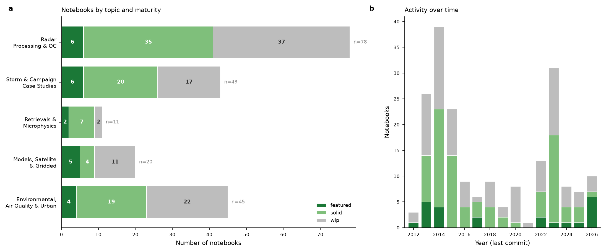

# Scott Collis — Notebook Collection

A working archive of weather-radar and atmospheric-science Jupyter notebooks, spanning **2012–2026**. It documents more than a decade of radar signal processing, field-campaign analysis, quantitative precipitation retrievals, model/satellite data workflows, and — more recently — urban environmental and air-quality sensing.

The collection is built primarily on the open-source atmospheric-science Python stack: [Py-ART](https://arm-doe.github.io/pyart/), MetPy, xarray, Cartopy, and ACT. It ranges from polished, reusable examples to raw experiments — the structure below separates the two so you can find the showcase pieces quickly.

*Left: notebooks by topic and maturity tier. Right: activity by year (most recent commit touching each notebook).*

## At a glance

- **199 notebooks** total across six directories
- **24 featured** — substantial, documented, largely runnable, showcase-worthy
- **86 solid** — working and useful, lightly documented or single-purpose
- **89 works-in-progress** — experiments, tests, and drafts, quarantined in [`00_works_in_progress/`](00_works_in_progress/)
- Notebooks in both the current (nbformat v4) and legacy (nbformat v3 / IPython worksheets) formats are preserved as-is

## Start here — featured notebooks

The 23 most complete and instructive notebooks, grouped by topic:

### Radar Data Processing & Quality Control

- **[advection_interpolation/Radar_Volume_Advection_Interpolation.ipynb](01_radar_processing_qc/advection_interpolation/Radar_Volume_Advection_Interpolation.ipynb)** — Temporal interpolation of radar volumes by optical-flow advection morphing on native gate geometry (C-SAPR / MC3E)
- **[AGU_analysis.ipynb](01_radar_processing_qc/AGU_analysis.ipynb)** — Phase processing and attenuation correction using linear programming for ARM X-band radars
- **[Demonstration of Py-ART for the Computation Instutute .ipynb](01_radar_processing_qc/Demonstration%20of%20Py-ART%20for%20the%20Computation%20Instutute%20.ipynb)** — Py-ART tutorial: radar I/O, dual-pol fields, smoothing, map display
- **[LP processing of PHIDP.ipynb](01_radar_processing_qc/LP%20processing%20of%20PHIDP.ipynb)** — Linear programming phase unwrapping for differential phase PHIDP
- **[Quick Slice.ipynb](01_radar_processing_qc/nexrad/Quick%20Slice.ipynb)** — Quick 2D slicing and visualization of NEXRAD radar data for rapid laptop exploration
- **[nexrad_echo_area_timeseries.ipynb](01_radar_processing_qc/nexrad_echo_area_timeseries.ipynb)** — Compute 24-hour NEXRAD echo-area timeseries above reflectivity threshold
- **[xarray pyart integration.ipynb](01_radar_processing_qc/xarray%20pyart%20integration.ipynb)** — Fetch NEXRAD from AWS, grid with Py-ART, visualize with xarray and MetPy

### Storm & Field-Campaign Case Studies

- **[DYNAMO AIME workshop workbook.ipynb](02_case_studies/DYNAMO%20AIME%20workshop%20workbook.ipynb)** — DYNAMO field campaign radar processing and VAD wind retrieval workbook
- **[Image segmentation.ipynb](02_case_studies/Image%20segmentation.ipynb)** — Image segmentation analysis of MC3E C-SAPR radar rainfall fields
- **[Tracking for ERAD.ipynb](02_case_studies/Tracking%20for%20ERAD.ipynb)** — Image segmentation and object tracking on C-SAPR radar rain rates from MC3E campaign
- **[Tracking-Manus.ipynb](02_case_studies/Tracking-Manus.ipynb)** — Image segmentation and rainfall object tracking on ARM C-SAPR radar data using watershed algorithm
- **[Tracking.ipynb](02_case_studies/Tracking.ipynb)** — Image segmentation and object tracking on MC3E C-SAPR radar rainfall data
- **[sgp_goes_nexrad.ipynb](02_case_studies/sgp_goes_nexrad.ipynb)** — Fetch NEXRAD from AWS, grid with ISCCP satellite data over SGP site

### Retrievals & Microphysics

- **[U-Bonn-reduced.ipynb](03_retrievals_microphysics/UBonn/U-Bonn-reduced.ipynb)** — Retrieves propagation and backscatter differential phase from X-Band radar

### Models, Satellite & Gridded Data

- **[HRRR_CAPE_SREH_Chicagoland.ipynb](04_models_satellite_gridded/HRRR_CAPE_SREH_Chicagoland.ipynb)** — HRRR severe-weather analysis: CAPE, SRH, soundings over Chicagoland
- **[HRRR_Smoke_Forecast_Animation.ipynb](04_models_satellite_gridded/HRRR_Smoke_Forecast_Animation.ipynb)** — HRRR-Smoke forecast animation with AirNow PM₂.₅ observations overlay
- **[Herbie_Clouds_Example.ipynb](04_models_satellite_gridded/Herbie_Clouds_Example.ipynb)** — Downloads HRRR cloud/meteorology forecasts via Herbie, extracts Chicago column profiles
- **[NWSAPI.ipynb](04_models_satellite_gridded/NWSAPI.ipynb)** — Query NWS API, fetch alert zones, visualize warnings on Cartopy map
- **[totallynormal.ipynb](04_models_satellite_gridded/totallynormal.ipynb)** — Compares climate normals between Bend and Mt Bachelor using NOAA gridded data

### Environmental Sensing, Air Quality & Urban

- **[Boston Snow Retrieval.ipynb](05_environmental_airquality_urban/urban/Boston%20Snow%20Retrieval.ipynb)** — Retrieves snowfall rates from WSR-88D radar using Z-S relations
- **[Historic_Smoke_AirNow.ipynb](05_environmental_airquality_urban/Historic_Smoke_AirNow.ipynb)** — Ranks July 2026 Chicago wildfire smoke against 16 years of AirNow PM2.5 observations
- **[Wildfire_Smoke_AirNow.ipynb](05_environmental_airquality_urban/Wildfire_Smoke_AirNow.ipynb)** — Maps wildfire smoke PM2.5 across US/Canada using AirNow API and ACT visualization
- **[Wildfire_Smoke_Source_to_City.ipynb](05_environmental_airquality_urban/Wildfire_Smoke_Source_to_City.ipynb)** — Traces Canadian wildfire smoke to US cities via HMS, AirNow, HRRR wind fields.
- **[boston.ipynb](05_environmental_airquality_urban/urban/boston.ipynb)** — Boston radar reflectivity mapping and recent-time radar retrieval workflow

## Directory map

| Directory | Notebooks | Focus |
|---|---:|---|
| [`00_works_in_progress/`](00_works_in_progress/) | 71 | Experiments, tests, scratch analyses, and abandoned drafts. Kept for provenance and the occasional reusable snippet, but not polished. Expect broken cells, hard-coded paths, and half-finished ideas. |
| [`01_radar_processing_qc/`](01_radar_processing_qc/) | 45 | Dealiasing, differential-phase (PHIDP/KDP) processing, attenuation correction, CMAC, gridding, gate filtering, dual-pol corrections, and radar I/O — the core Py-ART processing chain. |
| [`02_case_studies/`](02_case_studies/) | 26 | Analyses tied to a specific storm, event, location, or field campaign — hurricanes, tornadoes, hail, and campaigns such as TWP-ICE, DYNAMO, MC3E, and CACTI. |
| [`03_retrievals_microphysics/`](03_retrievals_microphysics/) | 11 | Quantitative retrievals: T-matrix scattering, self-consistency, drop-size distributions, disdrometer analysis, rainfall/QPE estimation, and path-integrated attenuation. |
| [`04_models_satellite_gridded/`](04_models_satellite_gridded/) | 9 | Working with HRRR, GOES, Herbie, GRIB/ZARR, reanalysis, NWP output, satellite imagery, and gridded product workflows — including the NWS API. |
| [`05_environmental_airquality_urban/`](05_environmental_airquality_urban/) | 37 | AirNow/smoke air-quality analysis, the CROCUS urban testbed, WXT weather stations, SAGE/ambient IoT sensors, lidar/ceilometers, and other non-radar in-situ sensing. |

Each directory has its own `README.md` index with a full table of its notebooks, descriptions, maturity status, and dates. Self-contained project folders (e.g. `CROCUS/`, `canned_sapr_investigations/`, `tracer/`, `nexrad/`, `scipy2014/`, `UBonn/`, `urban/`, `gap_anal/`) were moved as units into their best-fit category so their internal data and relative paths remain intact.

## The toolkit

Most-used scientific libraries across the collection:

| Library | Notebooks | Role |
|---|---:|---|
| `pyart` | 143 | Radar I/O, gridding, dual-pol processing |
| `xarray` | 55 | Labeled N-D arrays |
| `cartopy` | 48 | Geographic mapping |
| `metpy` | 27 | Meteorological calculations |
| `netCDF4` | 79 | NetCDF file I/O |
| `pandas` | 43 | Tabular / time-series data |
| `scipy` | 39 | Signal processing & optimization |
| `act` | 13 | ARM/atmospheric data toolkit |
| `sage_data_client` | 19 | CROCUS / SAGE sensor data |
| `herbie` | 5 | HRRR/NWP model retrieval |
| `xmovie` | 8 | Animated xarray fields |
| `pytmatrix` | 7 | T-matrix scattering |
| `nexradaws` | 8 | NEXRAD AWS access |

## How this was organized

Every notebook was parsed and profiled — documentation depth, code volume, fraction of cells executed, presence of figures, error states, imports, and git history — and its content was read to assign a topical category and a maturity tier. The two signals (quantitative profile + content read) were combined into the featured / solid / work-in-progress tiers used throughout. The complete machine-readable index, including per-notebook descriptions and metrics, is in [`notebook_inventory.csv`](notebook_inventory.csv).

> **Note on descriptions and tiers:** the one-line descriptions and maturity labels are automated assessments meant to aid navigation, not authoritative summaries. Corrections welcome.

---

*Author: Scott Collis. Collection restructured and indexed with assistance from Claude (Anthropic).*