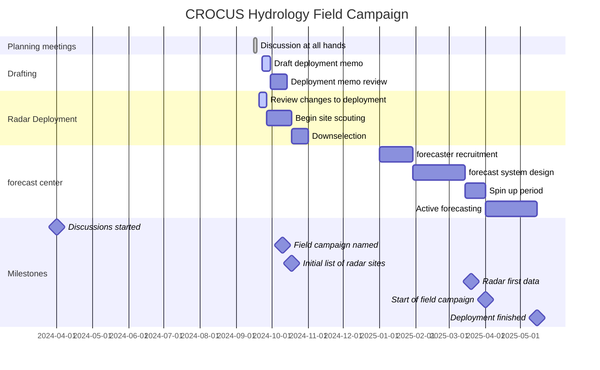

```mermaid
gantt
    title CROCUS Hydrology Field Campaign
    dateFormat  YYYY-MM-DD
    tickInterval 2weeks
    section Planning meetings
    Discussion at all hands :done, d1, 2024-09-16, 2d
    section Drafting
    Draft deployment memo :active, dm1, 2024-09-23, 1w
    Deployment memo review :dmr1, after dm1, 2w
    section Radar Deployment
    Review changes to deployment :active, radar1, 2024-09-20, 1w
    Begin site scouting :radar2, after radar1, 3w
    Downselection :radar3, after radar2, 2w
    section forecast center
    forecaster recruitment : recr, 2025-01-01, 4w
    forecast system design : design, after recr, until spinup
    Spin up period :spinup, 2025-03-15, until gotime
    Active forecasting : critical, after gotime, until endtime 
    section Milestones
    Discussions started :milestone, r1, 2024-04-01, 0d
    Field campaign named :milestone, r11, 2024-10-10, 0d
    Initial list of radar sites :milestone, radar3, after radar2, 0d
    Radar first data :milestone, radardara, 2025-03-20, 0d
    Start of field campaign :milestone, gotime, 2025-04-01, 0d
    Deployment finished :milestone, endtime, 2025-05-15, 0d
```
