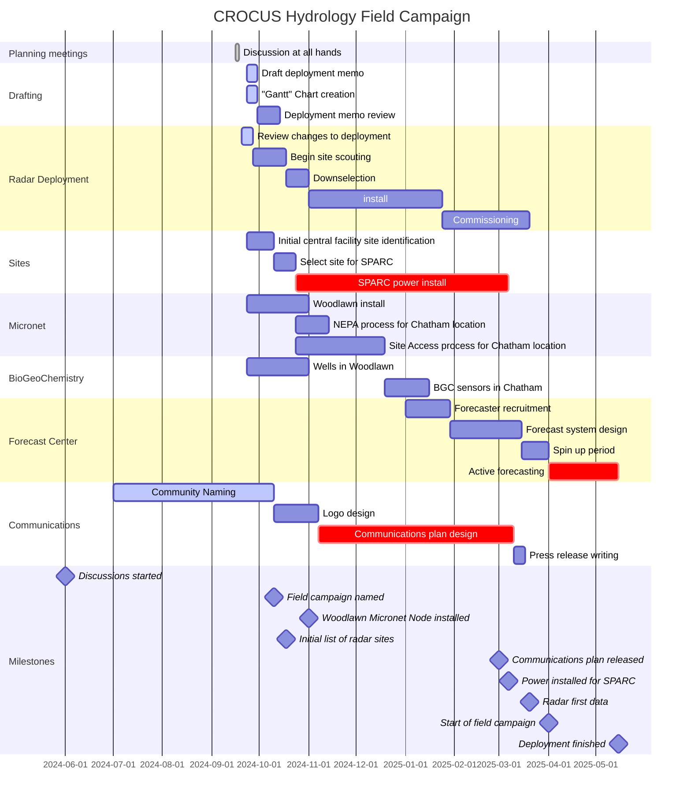

```mermaid <!-- element style="width:10%; height:auto" -->
---

config:

theme: forest

fontSize: 18pt

---

gantt

title CROCUS Hydrology Field Campaign

dateFormat YYYY-MM-DD

tickInterval 2weeks

  

section Planning meetings

Discussion at all hands :done, d1, 2024-09-16, 2d

  

section Drafting

Draft deployment memo :active, dm1, 2024-09-23, 1w

"Gantt" Chart creation :active, 2024-09-23, 1w

Deployment memo review :dmr1, after dm1, 2w

  

section Radar Deployment

Review changes to deployment :active, radar1, 2024-09-20, 1w

Begin site scouting :radar2, after radar1, 3w

Downselection :radarsel, after radar2, 2w

install :radar4, after radarsel, 12w

Commissioning :radarcom, after radar4, until radardata

section Sites

Initial central facility site identification : cfsite, 2024-09-23, 2024-10-10

Select site for SPARC : cfconfirm, after cfsite, 2w

SPARC power install :crit, sparcinstall, after cfconfirm, until sparcpower

  

section Micronet

Woodlawn install : microwl, 2024-09-23, until wlinst

NEPA process for Chatham location : microchatham, after cfconfirm, 3w

Site Access process for Chatham location: saachat, after cfconfirm, 8w

  

section BioGeoChemistry

Wells in Woodlawn : bgcwells, 2024-09-23, until wlinst

BGC sensors in Chatham : chathsense, after saachat, 4w

  

section Forecast Center

Forecaster recruitment : recr, 2025-01-01, 4w

Forecast system design : design, after recr, until spinup

Spin up period : spinup, 2025-03-15, until afore

Active forecasting :crit, afore, after gotime, until endtime

  

section Communications

Community Naming :active, 2024-07-01, 2024-10-10

Logo design : ldes, after r11, 4w

Communications plan design :crit, cplan, after ldes, 2025-03-10

Press release writing: presser, after cplan, 1w

  

section Milestones

Discussions started :milestone, r1, 2024-06-01, 0d

Field campaign named :milestone, r11, 2024-10-10, 0d

Woodlawn Micronet Node installed :milestone, wlinst, 2024-11-01, 0d

Initial list of radar sites :milestone, radar3, after radar2, 0d

Communications plan released :milestone, comsplan, 2025-03-01, 0d

Power installed for SPARC :milestone, sparcpower, 2025-03-07, 0d

Radar first data :milestone, radardata, 2025-03-20, 0d

Start of field campaign :milestone, gotime, 2025-04-01, 0d

Deployment finished :milestone, endtime, 2025-05-15, 0d
```

